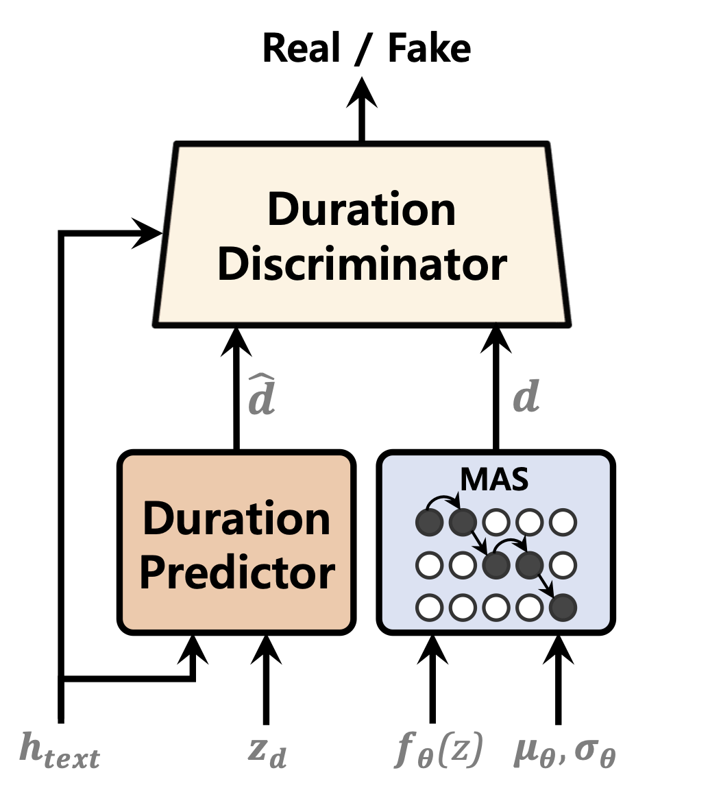
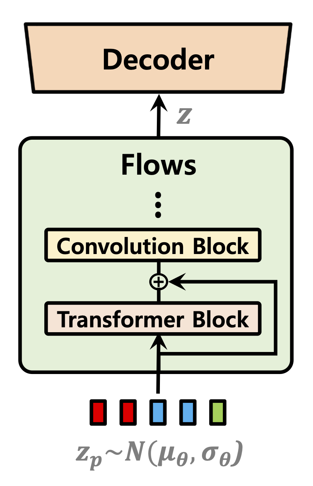
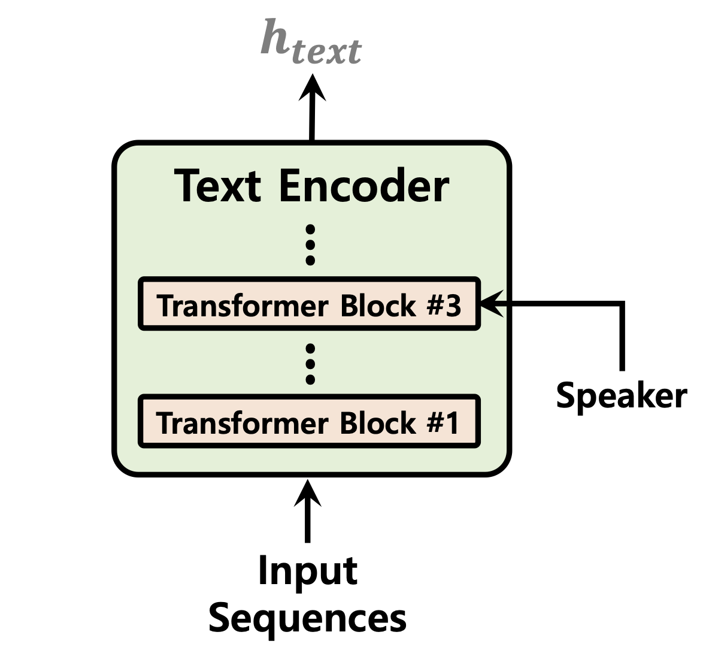

# VITS2: Improving Quality and Efficiency of Single-Stage Text-to-Speech with Adversarial Learning and Architecture Design

### Jungil Kong, Jihoon Park, Beomjeong Kim, Jeongmin Kim, Dohee Kong, Sangjin Kim

### SK Telecom, South Korea

Single-stage text-to-speech models have been actively studied recently, and their results have outperformed two-stage pipeline systems. Although the previous single-stage model has made great progress, there is room for improvement in terms of its intermittent unnaturalness, computational efficiency, and strong dependence on phoneme conversion. In this work, we introduce VITS2, a single-stage text-to-speech model that efficiently synthesizes a more natural speech by improving several aspects of the previous work. We propose improved structures and training mechanisms and present that the proposed methods are effective in improving naturalness, similarity of speech characteristics in a multi-speaker model, and efficiency of training and inference. Furthermore, we demonstrate that the strong dependence on phoneme conversion in previous works can be significantly reduced with our method, which allows a fully end-to-end single-stage approach.

Demo: https://vits-2.github.io/demo/

Paper: https://arxiv.org/abs/2307.16430

Unofficial implementation of VITS2. This is a work in progress. Please refer to [TODO](#todo) for more details.

<table style="width:100%">
  <tr>
    <th>Duration Predictor</th>
    <th>Normalizing Flows</th>
    <th>Text Encoder</th>
  </tr>
  <tr>
    <td></td>
    <td></td>
    <td></td>
  </tr>
</table>

## Audio Samples

[In progress]

Audio sample after 52,000 steps of training on 1 GPU for LJSpeech dataset:
https://github.com/daniilrobnikov/vits2/assets/91742765/d769c77a-bd92-4732-96e7-ab53bf50d783

## Installation:

<a name="installation"></a>

**Clone the repo**

```shell
git clone git@github.com:daniilrobnikov/vits2.git
cd vits2
```

## Setting up the conda env

This is assuming you have navigated to the `vits2` root after cloning it.

**NOTE:** This is tested under `python3.11` with conda env. For other python versions, you might encounter version conflicts.

**PyTorch 2.0**
Please refer [requirements.txt](requirements.txt)

```shell
# install required packages (for pytorch 2.0)
conda create -n vits2 python=3.11
conda activate vits2
pip install -r requirements.txt

conda env config vars set PYTHONPATH="/path/to/vits2"
```

## Download datasets

There are three options you can choose from: LJ Speech, VCTK, or custom dataset.

1. LJ Speech: [LJ Speech dataset](#lj-speech-dataset). Used for single speaker TTS.
2. VCTK: [VCTK dataset](#vctk-dataset). Used for multi-speaker TTS.
3. Custom dataset: You can use your own dataset. Please refer [here](#custom-dataset).

### LJ Speech dataset

1. download and extract the [LJ Speech dataset](https://keithito.com/LJ-Speech-Dataset/)

```shell
wget https://data.keithito.com/data/speech/LJSpeech-1.1.tar.bz2
tar -xvf LJSpeech-1.1.tar.bz2
cd LJSpeech-1.1/wavs
rm -rf wavs
```

3. preprocess mel-spectrograms. See [mel_transform.py](preprocess/mel_transform.py)

```shell
python preprocess/mel_transform.py --data_dir /path/to/LJSpeech-1.1 -c datasets/ljs_base/config.yaml
```

3. preprocess text. See [prepare/filelists.ipynb](datasets/ljs_base/prepare/filelists.ipynb)

4. rename or create a link to the dataset folder.

```shell
ln -s /path/to/LJSpeech-1.1 DUMMY1
```

### VCTK dataset

1. download and extract the [VCTK dataset](https://www.kaggle.com/datasets/showmik50/vctk-dataset)

```shell
wget https://datashare.is.ed.ac.uk/bitstream/handle/10283/3443/VCTK-Corpus-0.92.zip
unzip VCTK-Corpus-0.92.zip
```

2. (optional): downsample the audio files to 22050 Hz. See [audio_resample.ipynb](preprocess/audio_resample.ipynb)

3. preprocess mel-spectrograms. See [mel_transform.py](preprocess/mel_transform.py)

```shell
python preprocess/mel_transform.py --data_dir /path/to/VCTK-Corpus-0.92 -c datasets/vctk_base/config.yaml
```

4. preprocess text. See [prepare/filelists.ipynb](datasets/ljs_base/prepare/filelists.ipynb)

5. rename or create a link to the dataset folder.

```shell
ln -s /path/to/VCTK-Corpus-0.92 DUMMY2
```

### Custom dataset

1. create a folder with wav files
2. duplicate the `ljs_base` in `datasets` directory and rename it to `custom_base`
3. open [custom_base](datasets/custom_base) and change the following fields in `config.yaml`:

```yaml
data:
  training_files: datasets/custom_base/filelists/train.txt
  validation_files: datasets/custom_base/filelists/val.txt
  text_cleaners: # See text/cleaners.py
    - phonemize_text
    - tokenize_text
    - add_bos_eos
  cleaned_text: true # True if you ran step 6.
  language: en-us # language of your dataset. See espeak-ng
  sample_rate: 22050 # sample rate, based on your dataset
  ...
  n_speakers: 0 # 0 for single speaker, > 0 for multi-speaker
```

4. preprocess mel-spectrograms. See [mel_transform.py](preprocess/mel_transform.py)

```shell
python preprocess/mel_transform.py --data_dir /path/to/custom_dataset -c datasets/custom_base/config.yaml
```

6. preprocess text. See [prepare/filelists.ipynb](datasets/ljs_base/prepare/filelists.ipynb)

**NOTE:** You may need to install `espeak-ng` if you want to use `phonemize_text` cleaner. Please refer [espeak-ng](https://github.com/espeak-ng/espeak-ng)

7. rename or create a link to the dataset folder.

```shell
ln -s /path/to/custom_dataset DUMMY3
```

## Training Examples

```shell
# LJ Speech
python train.py -c datasets/ljs_base/config.yaml -m ljs_base

# VCTK
python train_ms.py -c datasets/vctk_base/config.yaml -m vctk_base

# Custom dataset (multi-speaker)
python train_ms.py -c datasets/custom_base/config.yaml  -m custom_base
```

## Inference Examples

See [inference.ipynb](inference.ipynb) and [inference_batch.ipynb](inference_batch.ipynb)

## Pretrained Models

[In progress]

## Todo

- [ ] model (vits2)
  - [x] update TextEncoder to support speaker conditioning
  - [x] support for high-resolution mel-spectrograms in training. See [mel_transform.py](preprocess/mel_transform.py)
  - [x] Monotonic Alignment Search with Gaussian noise
  - [x] Normalizing Flows using Transformer Block
  - [ ] Stochastic Duration Predictor with Time Step-wise Conditional Discriminator
- [ ] model (YourTTS)
  - [ ] Language Conditioning
  - [ ] Speaker Encoder
- [ ] model (NaturalSpeech)
  - [x] KL Divergence Loss after Prior Enhancing
  - [ ] GAN loss for e2e training
- [ ] other
  - [x] support for batch inference
  - [x] special tokens in tokenizer
  - [x] test numba.jit and numba.cuda.jit implementations of MAS. See [monotonic_align.py](monotonic_align.py)
  - [ ] KL Divergence Loss between TextEncoder and Projection
  - [ ] support for streaming inference. Please refer [vits_chinese](https://github.com/PlayVoice/vits_chinese/blob/master/text/symbols.py)
  - [ ] use optuna for hyperparameter tuning
- [ ] future work
  - [ ] update model to vits2. Please refer [VITS2](https://arxiv.org/abs/2307.16430)
  - [ ] update model to YourTTS with zero-shot learning. See [YourTTS](https://arxiv.org/abs/2112.02418)
  - [ ] update model to NaturalSpeech. Please refer [NaturalSpeech](https://arxiv.org/abs/2205.04421)

## Acknowledgements

- This is unofficial repo based on [VITS2](https://arxiv.org/abs/2307.16430)
- g2p for multiple languages is based on [phonemizer](https://github.com/bootphon/phonemizer)
- We also thank GhatGPT for providing writing assistance.

## References

- [VITS2: Improving Quality and Efficiency of Single-Stage Text-to-Speech with Adversarial Learning and Architecture Design](https://arxiv.org/abs/2307.16430)
- [Conditional Variational Autoencoder with Adversarial Learning for End-to-End Text-to-Speech](https://arxiv.org/abs/2106.06103)
- [YourTTS: Towards Zero-Shot Multi-Speaker TTS and Zero-Shot Voice Conversion for everyone](https://arxiv.org/abs/2112.02418)
- [NaturalSpeech: End-to-End Text to Speech Synthesis with Human-Level Quality](https://arxiv.org/abs/2205.04421)
- [A TensorFlow implementation of Google's Tacotron speech synthesis with pre-trained model (unofficial)](https://github.com/keithito/tacotron)

# VITS2
